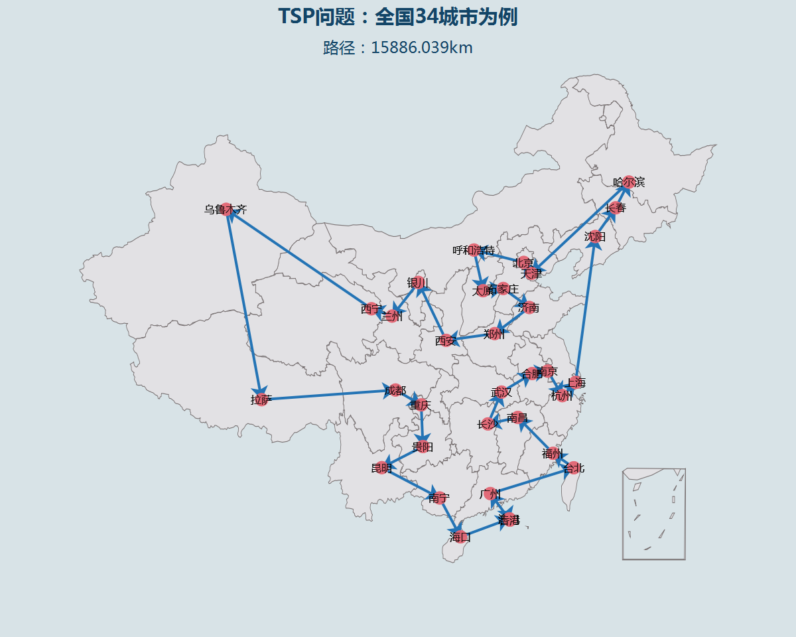

#  Traveling Salesman

### 文件说明

 * **1，读取城市的经纬度文件，根据公式计算城市间的距离**
 
    + **34城市的经纬度文件：[34个城市经纬度.xlsx](https://github.com/Anfany/Funny-Math-Problem-by-Python3/blob/master/Traveling%20Salesman/城市经纬度(34).xlsx)**
    
    + **106城市的经纬度文件：[106个城市经纬度.xlsx](https://github.com/Anfany/Funny-Math-Problem-by-Python3/blob/master/Traveling%20Salesman/城市经纬度(106).xlsx)**
    
    + **城市之间的距离csv文件：[city_distance.csv](https://github.com/Anfany/Funny-Math-Problem-by-Python3/blob/master/Traveling%20Salesman/city_distance.csv)**
    
    + **城市的数字对应csv文件：[city_sign.csv](https://github.com/Anfany/Funny-Math-Problem-by-Python3/blob/master/Traveling%20Salesman/city_sign.csv)**
    
    + **读取csv文件的程序：[read_distance.py](https://github.com/Anfany/Funny-Math-Problem-by-Python3/blob/master/Traveling%20Salesman/read_distance.py)**
       
    
 * **2，在地图上展示结果的程序**
 
    + **地图展示的程序：[show_result.py](https://github.com/Anfany/Funny-Math-Problem-by-Python3/blob/master/Traveling%20Salesman/show_result.py)**

 * **3，遗传函数以及最终结果展示的程序**
 
    + **主程序：[genetic_algorithm_tsp_greedy.py](https://github.com/Anfany/Funny-Math-Problem-by-Python3/blob/master/Traveling%20Salesman/genetic_algorithm_tsp_greedy.py)**
    
    
  * **4，结果展示**
 
    + **迭代结果**
    
    
    
    + **路径动态展示**
    
    
    
    
    + **最终的路径**
    
    
    
